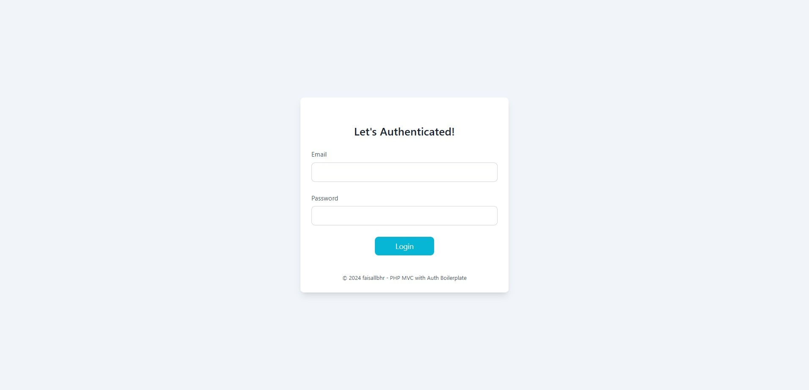
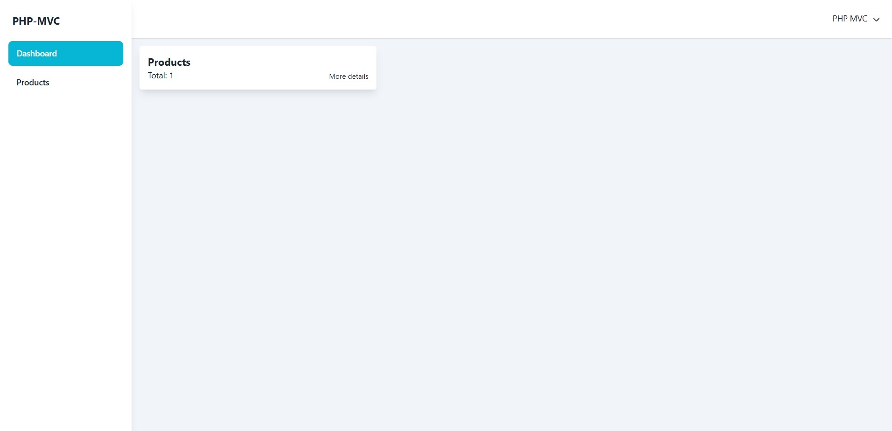
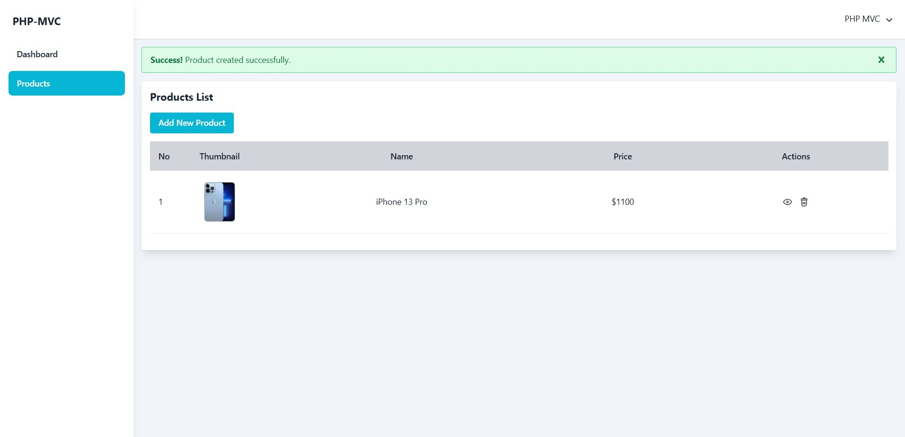
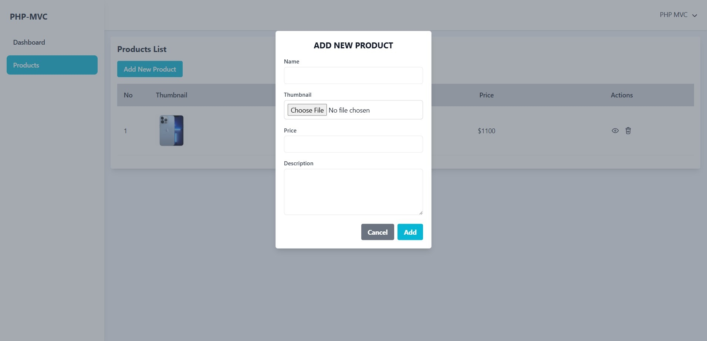
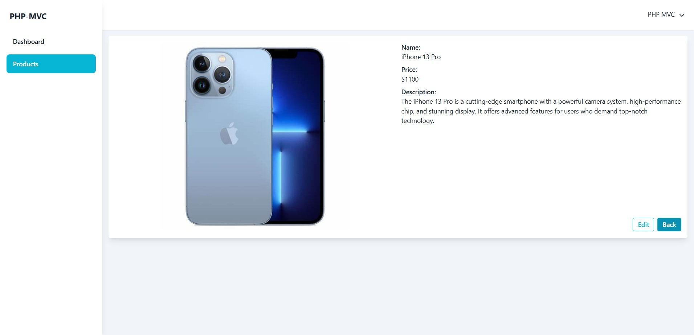

# PHP MVC with Authentication Boilerplate

I hate the syntax, but I never give up :D

### Welcome



### Dashboard



### Products Table



### Create Product



### Product Detail



## How to use it?

Clone the repository to your web server:

```bash
git clone https://github.com/faisallbhr/php-mvc-auth-boilerplate.git
```

Open the utils/DBConnection.php file then customize it with your database:

```php
private function __construct()
{
    try {
        $this->pdo = new PDO("mysql:host=localhost;dbname=php_mvc", 'root', '');
        $this->pdo->setAttribute(PDO::ATTR_ERRMODE, PDO::ERRMODE_EXCEPTION);
    } catch (PDOException $e) {
        die('Database connection failed: ' . $e->getMessage());
    }
}
```

Import SQL from /utils/db.sql into your database

Run your server, then access this project🤙

## Let's try it!

I didn't really like using native PHP before, but I tried it and enjoyed it :D
